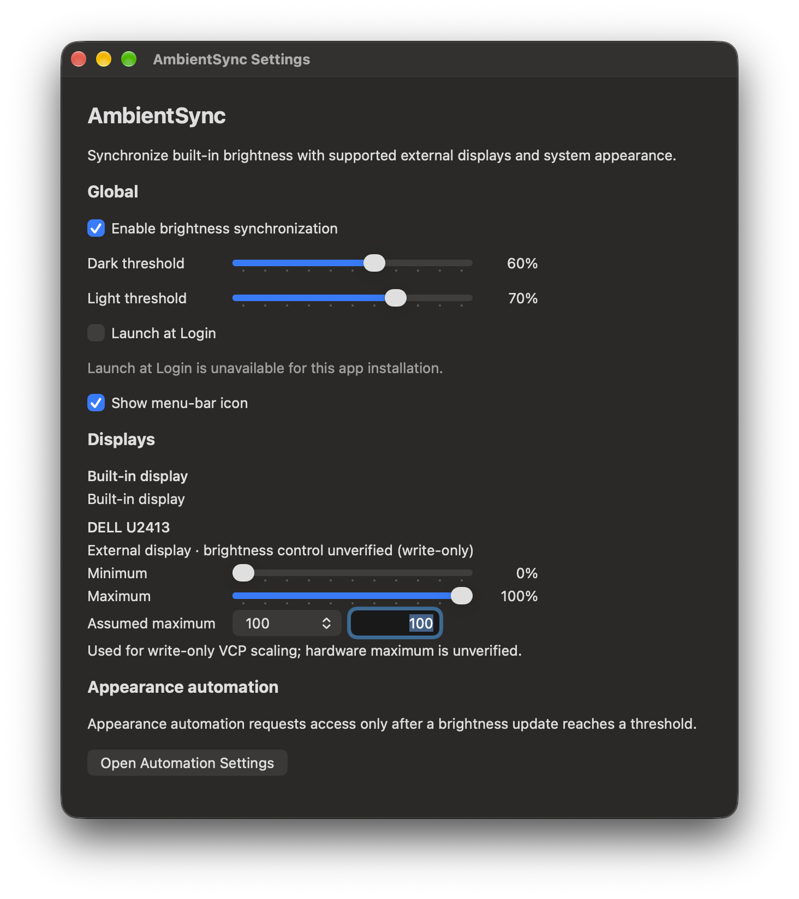

# AmbientSync — macOS brightness sync and automatic Dark Mode

<picture>
  <source media="(prefers-color-scheme: dark)" srcset="docs/assets/branding/logo-dark.svg">
  
</picture>

AmbientSync is a native macOS menu-bar app that syncs supported DDC/CI external monitor brightness to your built-in display brightness, with adjustable mapping for each display. It also automatically switches system Light/Dark appearance at configured brightness thresholds.

Compatibility and development:

- Apple silicon
- macOS 26 or newer, including full compatibility with macOS 27
- Xcode 27 for development; the existing CI environment uses Xcode 26.6 (17F113) and its bundled macOS 26.5 SDK

## Installation

AmbientSync requires Apple silicon and macOS 26 or newer.

### Homebrew Cask

Install from the public [Homebrew tap](https://github.com/fridaypatrick/homebrew-tap):

```sh
brew install --cask fridaypatrick/tap/ambientsync
```

### GitHub Releases DMG

Download the latest [GitHub Release](https://github.com/fridaypatrick/ambient-sync/releases) and select `AmbientSync-<version>-arm64.dmg`. Open the DMG, drag AmbientSync to **Applications**, eject the disk image, and launch AmbientSync from Applications, Finder, Spotlight, or Launchpad.

Published DMG releases are signed and notarized; no `xattr` or Gatekeeper bypass is required.

## Features

- Keep external brightness in sync as built-in display brightness changes.
- Adjust brightness mapping separately for each supported DDC/CI external display.
- Switch system Light/Dark appearance at separate brightness thresholds, with hysteresis to prevent repeated switching near a threshold.
- Start AmbientSync automatically with Launch at Login.
- Hide the menu-bar icon and reopen the app to recover access to Settings.
- Keep your settings between launches.

Per-display mappings use stable display identities when available. First-run defaults are 0–100% external mapping, Dark at 25%, Light at 40%, brightness synchronization enabled, menu icon visible, and Launch at Login disabled.

Displays whose VCP brightness reads fail are included only when their private IOAVService match is high-confidence. AmbientSync labels these controls **unverified (write-only)** and uses a persisted assumed VCP maximum of 100 by default; Settings supports 100, 255, or a custom maximum from 1 through 65535. Three consecutive transport write failures pause that display until re-enumeration or explicit Retry. Discovery and lifecycle rebuilds do not issue brightness writes.

## Screenshot



Illustrative settings; display status depends on hardware, and Launch at Login availability depends on the app installation. This example shows an unverified (write-only) external display and unavailable Launch at Login, not verification of all displays.

## FAQ

### Which external monitors are supported?

AmbientSync supports external monitors with compatible DDC/CI brightness controls; support depends on the display, adapter, and connection. See [Privacy and security](#privacy-and-security) for hardware-validation and private-API caveats.

### What triggers Light/Dark switching?

AmbientSync switches system appearance when built-in display brightness reaches your configured Dark or Light threshold, not from direct ambient-light sensor measurement. See [Usage](#usage) for the available settings.

### Does AmbientSync work offline?

Yes. AmbientSync makes no network requests and includes no analytics, telemetry, or data collection; see [Privacy and security](#privacy-and-security).

## Build and test

Run from repository root after a clean clone. These commands build and test the checked-in `AmbientSync` scheme without code signing:

```sh
xcodebuild build \
  -project AmbientSync.xcodeproj \
  -scheme AmbientSync \
  -configuration Debug \
  -destination 'platform=macOS,arch=arm64' \
  CODE_SIGNING_ALLOWED=NO

xcodebuild test \
  -project AmbientSync.xcodeproj \
  -scheme AmbientSync \
  -configuration Debug \
  -destination 'platform=macOS,arch=arm64' \
  CODE_SIGNING_ALLOWED=NO
```

For interactive local use, open `AmbientSync.xcodeproj` in Xcode. Use local ad-hoc signing or your personal signing team in local Xcode settings; no development team is committed to this project. Hardware behavior must be validated on a real Mac and display setup.

## Usage

Launch AmbientSync after installing it with Homebrew or the GitHub Releases DMG, or run it from Xcode or a locally built app. Use the menu-bar icon for **Settings…** and **Quit AmbientSync**. Settings includes brightness synchronization, detected display status, per-display minimum and maximum mapping, write-only assumed maximum controls, degraded-state Retry, Dark and Light thresholds, Launch at Login, menu-icon visibility, and appearance-automation status.

To hide the menu icon, turn off **Show menu-bar icon** in Settings. If it is hidden, reopen the already-running app from Finder, Spotlight, or Launchpad to show Settings and recover access. A 10–80% mapping produces 10%, 45%, and 80% external targets for internal brightness values of 0%, 50%, and 100%.

## System appearance permission

AmbientSync uses Apple Events only to control **System Events** for reading and setting system Light/Dark appearance. The first threshold-triggered appearance read or switch attempt can prompt for Automation permission; opening Settings alone does not request it.

If permission is denied, open **System Settings → Privacy & Security → Automation**, expand **AmbientSync**, and allow **System Events**. AmbientSync remains running and reports the permission status in Settings.

## Privacy and security

- No network requests
- No analytics
- No telemetry
- No data collection

AmbientSync is unsandboxed and uses private or unsupported APIs: `DisplayServices`, `IOAVService`, and `CoreDisplay`. It is not eligible for the Mac App Store, and these APIs may break on future macOS updates.

DDC/CI support varies by display, adapter, and connection. Private APIs, hot-plug handling, and sleep/wake behavior require validation with real hardware; they are not proven by the automated build and unit-test workflow.

## GitHub Actions

GitHub Actions performs source build and unit-test validation only on `macos-26`, using Xcode 26.6. It selects the bundled macOS 26.5 SDK and uses the same arm64, no-signing commands above. CI does not prove physical display behavior, DDC/CI operation, hot-plug or wake recovery, or private-API runtime behavior.

### Homebrew tap publishing setup

Maintainers must create a fine-grained GitHub personal access token scoped only to [`fridaypatrick/homebrew-tap`](https://github.com/fridaypatrick/homebrew-tap), with **Contents: Read and write** repository permission. Store it in the AmbientSync app repository under **Settings → Secrets and variables → Actions** as the repository secret `HOMEBREW_TAP_TOKEN`. The app repository's built-in `GITHUB_TOKEN` cannot push to the separate tap repository.

Choose an expiration date and rotate the token before it expires. Replace `HOMEBREW_TAP_TOKEN` with the replacement token when rotating. The tap repository's branch protection and rulesets must permit ordinary pushes by the token's owner to its default branch.

The release workflow updates the tap after publishing the GitHub release. A missing or expired token, insufficient permissions, or branch rules that block the push cause the cask update to fail; the GitHub release remains published. Users can still install the published DMG from GitHub Releases.

## Hardware smoke checklist

- [ ] Discover a compatible external display and verify a DDC/CI brightness write.
- [ ] Verify 10–80% mapping at internal 0%, 50%, and 100% brightness.
- [ ] Hot-plug an external display and verify re-enumeration and continued mapping.
- [ ] Sleep and wake the Mac and verify display recovery and brightness writes.
- [ ] Trigger appearance automation, test the permission prompt and denial path, and verify Light/Dark switching.
- [ ] Enable Launch at Login and verify login startup.
- [ ] Hide the menu icon, then reopen AmbientSync through Finder, Spotlight, or Launchpad.

## License and attribution

AmbientSync is licensed under [GPL-3.0-only](LICENSE). Adapted MonitorControl portions remain under the MIT License. The exact pinned upstream MonitorControl commit is `f16d90f29cefbd9fff47e26fc8f99fe7a5280deb`.

See [`THIRD_PARTY_NOTICES/MonitorControl-MIT.txt`](THIRD_PARTY_NOTICES/MonitorControl-MIT.txt) for the MonitorControl attribution and license notice.
